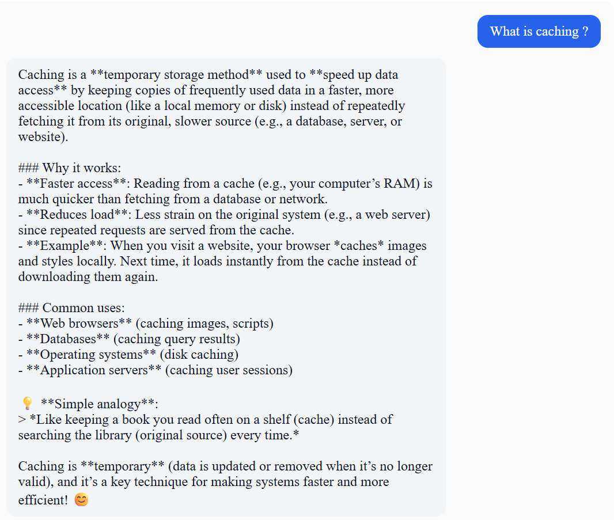
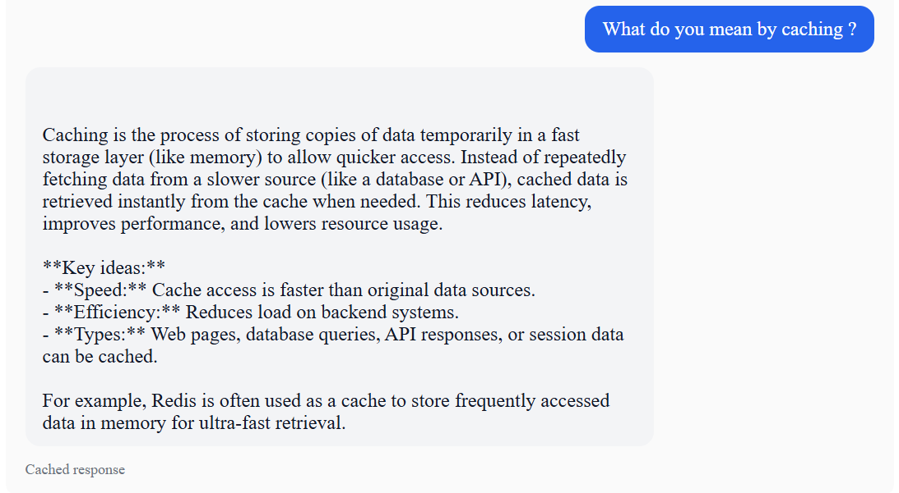

# AI Chat App with Semantic Caching

This project contains a simple chat application with:
- A FastAPI backend exposing `/api/chat`
- A React + TypeScript frontend
- Docker Compose support for running the entire application

## OpenRouter 

```
- Create a free API key from OpenRouter and configure it as OPENROUTER_API_KEY in your environment or .env file.
```

## Caching Strtegy

```
- Semantic Search: User queries are converted into sentence embeddings, and FAISS retrieves the most semantically similar cached query instead of relying on exact text matching.
- Redis Storage: Cached responses are stored in Redis, while FAISS maintains the embedding index for fast similarity search.
- Dynamic TTL: Cache expiration is determined by the LLM based on the expected freshness of the response, with a default fallback TTL if needed.

```

## Option 1: Run Backend and Frontend Separately

### Backend
```bash
cd src
pip install -r requirements.txt
uvicorn app.main:app --reload --host 0.0.0.0 --port 8000
```

Backend: http://localhost:8000

### Frontend
```bash
cd ui
npm install
npm run dev -- --host 0.0.0.0 --port 3000
```

Frontend: http://localhost:3000

---

## Option 2: Run with Docker Compose

Build and start both the backend and frontend with a single command:

```bash
docker compose up --build
```

- Frontend: http://localhost:3000
- Backend: http://localhost:8000


## Screenshots 

### LLM Response


### Cached Response

